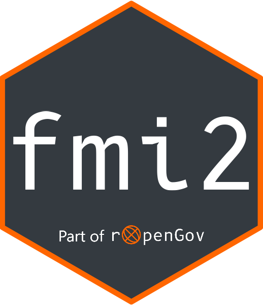

<!-- README.md is generated from README.Rmd. Please edit that file -->

```{r, include = FALSE}
knitr::opts_chunk$set(
  collapse = TRUE,
  comment = "#>",
  fig.path = "man/figures/README-",
  out.width = "100%"
)
```

# fmi2 - R client for the Finnish Meteorological Institute's (FMI) API <a href='https://ropengov.github.io/fmi2/'></a>

<!-- badges: start -->
[](https://ropengov.org/)
[](https://lifecycle.r-lib.org/articles/stages.html)
[](https://app.codecov.io/gh/rOpenGov/fmi2)
[](https://CRAN.R-project.org/package=fmi2)
[](https://github.com/rOpenGov/fmi2/actions)

<!-- badges: end -->

R client package for [the Finnish Meteorological Institute (FMI) open data API](https://en.ilmatieteenlaitos.fi/open-data-manual). `fmi2` provides access
to a subset of the FMI [download](https://en.ilmatieteenlaitos.fi/open-data-manual-accessing-data) 
service. FMI maintains and is reponsible for the data available through their
API, but has no official connections to `fmi2`. 

All data from the FMI is released under [the Creative Commons Attribution 4.0 
International license](https://creativecommons.org/licenses/by/4.0/).

## Installation

`fmi2` is not yet on CRAN, but you can install the development version 
from [GitHub](https://github.com/rOpenGov/fmi2) with:

```{r install, eval=FALSE}
# install.packages("remotes")
remotes::install_github("rOpenGov/fmi2")
```

## Details

Currently, the following FMI stored queries are available in `fmi2`:

```{r function-table, echo=FALSE, message=FALSE}
#library(fmi2)
devtools::load_all()
knitr::kable(list_queries(),
             col.names = c("Stored query", "Description", "No. parameters",
                           "fmi2 function name"))

```

There are also wrapper functions that call the functions above. These functions are:

```{r wrapper-functions, echo=FALSE}
functions <- c("get_precipitation", "get_temperature", "get_wind")
descriptions <- c("Returns precipitation observations", "Returns temperature observations",
                  "Returns wind observations")
wrappers <- suppressMessages(dplyr::bind_cols(functions, descriptions))
knitr::kable(wrappers,
             col.names = c("Function name", "Description"))
```

More data sets and queries may be wrapped in the future.

## Example

For usage examples, see the package [function reference](https://ropengov.github.io/fmi2//reference/index.html) and the following vignette:

- [Getting weather observation data](https://ropengov.github.io/fmi2//articles/weather_observation_data.html)

There are also the following articles:

- [Tutorial for fmi2 R package]()
- [Säähavaintojen hakeminen]()
- [Tutoriaali fmi2 R-paketille]()

## Contributing

If you have a particular need in mind, you're free to:

1. Fork the repository, modify the code and leave a pull request.
2. Leave an [issue](https://github.com/rOpenGov/fmi2/issues) with a description
on the improvements.

You can also leave bug reports at the [issues page](https://github.com/rOpenGov/fmi2/issues).

## Why fmi2?

If this is `fmi2`, where's the first `fmi`!? Good question, `fmi` can be found
[here](https://github.com/rOpenGov/fmi) and is no longer developed or 
maintained. `fmi` was developed back in the day when accessing data from a 
WFS in R was much more difficult. Hence, the package is much more complicated
than `fmi2` and too laborious to maintain.

## Acknowledgements

Kindly cite this work as follows: Joona Lehtomäki and Leo Lahti (rOpenGov 2024). fmi2: Finnish Meteorological Institute open data API R client. R package version 0.3.1. URL: https://github.com/rOpenGov/fmi2

We are grateful for all [contributors](https://github.com/rOpenGov/fmi2/graphs/contributors). This project is part of [rOpenGov](https://ropengov.org).

## Disclaimer

This package is in no way officially related to Finnish Meteorological Institute (Ilmantieteen laitos, FMI).

For information about FMI's open data lisence, please see their website:

* In English: [FMI's open data lisence](https://en.ilmatieteenlaitos.fi/open-data-licence)
* In Finnish: [FMI:n avoimen datan lisenssi](https://www.ilmatieteenlaitos.fi/avoin-data-lisenssi)
