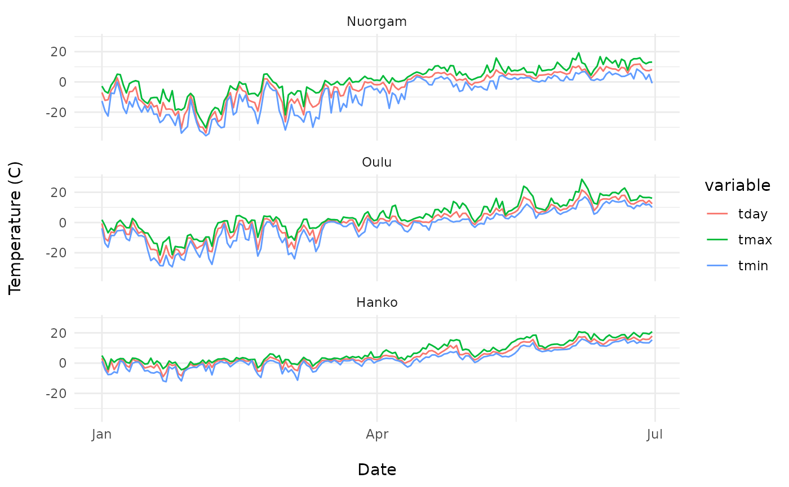

# fmi2: introduction

## Setup

`fmi2` is not yet in CRAN, so you’ll need to install it directly from
GitHub. While you’re at it, make sure you also install all the packages
below as we’ll be using them in this tutorial.

``` r

install.packages(c("DT", "ggplot2", "leaflet", "remotes", "sf", "tidyverse"))

remotes::install_github("ropengov/fmi2")
remotes::install_github("ropensci/skimr")
```

``` r

library(DT)
library(fmi2)
library(ggplot2)
library(knitr)
library(leaflet)
library(sf)
library(skimr)
```

## Getting started

You can retrieve weather stating observation data with various temporal
resolution using `fmi2`. First thing you need to know is of course which
location exactly you want to get the data from. The FMI API provides
multiple different ways of defining the spatial query area:

- **Bounding box** given by coordindates and defining an area
- **Place name** for which to provide data.
- **FMISID** numeric FMI observation station identifier
- **GEOID** numeric geoid of the location
- **WMO** code of the location

We’ll start off by using the **FMISID** identifies which is given to
each [FMI observation
stations](https://en.ilmatieteenlaitos.fi/observation-stations). The
online table is also available in `fmi2` using the function
[`fmi_stations()`](https://ropengov.github.io/fmi2/reference/fmi_stations.md):

``` r

station_data <- fmi2::fmi_stations() 

station_data %>% 
  DT::datatable()
```

We’re going to pick “Hanko Tulliniemi” as an example here and use its
FMISID (100946) to retrieve the data. As you can see from the table
above, it also provides the latlon (geographical) coordinates for the
observation station. Before we get the actual data, let’s visualize
Hanko region.

``` r

# Get data for Tulliniemi only
tulliniemi_station <- station_data %>% 
  dplyr::filter(fmisid == 100946)

# Plot on a map using leaflet
leaflet::leaflet(station_data) %>% 
  leaflet::setView(lng = tulliniemi_station$lon, 
                   lat = tulliniemi_station$lat, 
                   zoom = 11) %>% 
  leaflet::addTiles() %>%  
  leaflet::addMarkers(~lon, ~lat, popup = ~name, label = ~as.character(fmisid))
```

## Getting daily weather observation data

Now that we know how the address a specific observation station, we can
proceed to getting the actual data. `fmi2` providers several functions
to retrieving data with different variables and temporal resolution.
We’ll start with
[`obs_weather_daily()`](https://ropengov.github.io/fmi2/reference/obs_weather_daily.md)
which returns daily average observation data from a given location.
Let’s get the daily weather observation data for the first 6 monhts of
2019:

``` r

# Use Hanko Tulliniemi weather station FMISID
tulliniemi_data <- obs_weather_daily(starttime = "2019-01-01",
                                     endtime = "2019-06-30",
                                     fmisid = 100946)
```

In total, the function returned 1086 observations. You can also note the
following:

``` r

class(tulliniemi_data)
#> [1] "sf"         "data.frame"
```

which means that the data returned by
[`obs_weather_daily()`](https://ropengov.github.io/fmi2/reference/obs_weather_daily.md)
is a spatial `sf` object with the `geometry` column storing the
geographical information of the weather station. We’ll come back to this
later. Now we are interested in what *kind* of data did we actually get?
Let’s find out:

``` r

unique(tulliniemi_data$variable)
#> [1] "rrday"        "tday"         "snow"         "tmin"         "tmax"        
#> [6] "TG_PT12H_min"
```

So there are six variables with their corresponding values. `fmi2`
provides a helper function
[`describe_variables()`](https://ropengov.github.io/fmi2/reference/describe_variables.md)
that can be useful in finding out more about the variables:

``` r

var_descriptions <- fmi2::describe_variables(tulliniemi_data$variable)
var_descriptions %>% 
  DT::datatable()
```

[`obs_weather_daily()`](https://ropengov.github.io/fmi2/reference/obs_weather_daily.md)
returns data in so called long (or melted) format meaning that all
variable (i.e. parameter) names are contained in column `variable` and
corresponding values in `value` column. You can transform the data into
a wide format using `tidyr`:

``` r

wide_data <- tulliniemi_data %>% 
  tidyr::spread(variable, value) %>% 
  # Let's convert the sf object into a regular tibble
  sf::st_set_geometry(NULL)

wide_data %>% 
  DT::datatable()
```

Looks like there aren’t too much data for `rrday`, `snow` or
`TG_PT12H_min`. Let’s have a closer look at the data:

``` r

(skimr::skim(wide_data))
```

|                                                  |           |
|:-------------------------------------------------|:----------|
| Name                                             | wide_data |
| Number of rows                                   | 181       |
| Number of columns                                | 7         |
| \_\_\_\_\_\_\_\_\_\_\_\_\_\_\_\_\_\_\_\_\_\_\_   |           |
| Column type frequency:                           |           |
| Date                                             | 1         |
| numeric                                          | 6         |
| \_\_\_\_\_\_\_\_\_\_\_\_\_\_\_\_\_\_\_\_\_\_\_\_ |           |
| Group variables                                  | None      |

Data summary {.table}

**Variable type: Date**

| skim_variable | n_missing | complete_rate | min | max | median | n_unique |
|:---|---:|---:|:---|:---|:---|---:|
| time | 0 | 1 | 2019-01-01 | 2019-06-30 | 2019-04-01 | 181 |

**Variable type: numeric**

| skim_variable | n_missing | complete_rate | mean |   sd |    p0 |  p25 | p50 |  p75 | p100 | hist  |
|:--------------|----------:|--------------:|-----:|-----:|------:|-----:|----:|-----:|-----:|:------|
| rrday         |       181 |             0 |  NaN |   NA |    NA |   NA |  NA |   NA |   NA |       |
| snow          |       181 |             0 |  NaN |   NA |    NA |   NA |  NA |   NA |   NA |       |
| tday          |         0 |             1 | 4.74 | 6.46 |  -9.0 |  0.6 | 2.8 |  9.7 | 17.9 | ▂▇▇▃▅ |
| TG_PT12H_min  |       181 |             0 |  NaN |   NA |    NA |   NA |  NA |   NA |   NA |       |
| tmax          |         0 |             1 | 7.14 | 6.74 |  -4.4 |  2.2 | 4.5 | 12.5 | 20.8 | ▃▇▃▃▃ |
| tmin          |         0 |             1 | 2.65 | 6.66 | -12.3 | -1.8 | 1.6 |  7.6 | 15.9 | ▂▅▇▃▃ |

Seems like the above mentioned variables indeed don’t have data between
the defined days. Let’s get the same data from a couple of other
observation stations around finland. Note that this time we’re using
place name instead of a FMISID.

``` r

oulu_data <- obs_weather_daily(starttime = "2019-01-01",
                               endtime = "2019-06-30",
                               place = "Oulu")
nuorgam_data <- obs_weather_daily(starttime = "2019-01-01",
                                  endtime = "2019-06-30",
                                  place = "Nuorgam")
# Add location name to each data set and combine them
oulu_data$location <- "Oulu"
nuorgam_data$location <- "Nuorgam"
tulliniemi_data$location <- "Hanko"

all_data <- rbind(tulliniemi_data, oulu_data, nuorgam_data)
# Factorize location and make order explicit
all_data <- all_data %>% 
  dplyr::mutate(location = factor(location, 
                                  levels = c("Nuorgam", "Oulu", "Hanko"),
                                  ordered = TRUE))
```

Let’s plot the daily temperature data in different locations:

``` r

all_data %>% 
  dplyr::filter(variable == "tday" | variable == "tmax" | variable == "tmin") %>% 
  ggplot(aes(x = time, y = value, color = variable)) + 
  geom_line() + facet_wrap(~ location, ncol=1) + ylab("Temperature (C)\n") +
  xlab("\nDate") + theme_minimal()
```



## Getting hourly weather observation data

Instead of daily values, it is also possible to retrieve weather
observation data with finer temporal resolution, such as hourly data,
using the function
[`obs_weather_hourly()`](https://ropengov.github.io/fmi2/reference/obs_weather_hourly.md).
The data retrieved this has slightly different content as compared to
the daily data:

``` r

# Get the hourly observations for the first day of 2019 in Hanko Tulliniemi
tulliniemi_data <- fmi2::obs_weather_hourly(starttime = "2019-02-01",
                                            endtime = "2019-02-02",
                                            fmisid = 100946)
```

Again, let’s first have a look at what we actually got:

``` r

var_descriptions <- fmi2::describe_variables(tulliniemi_data$variable)
var_descriptions %>% 
  DT::datatable()
```
